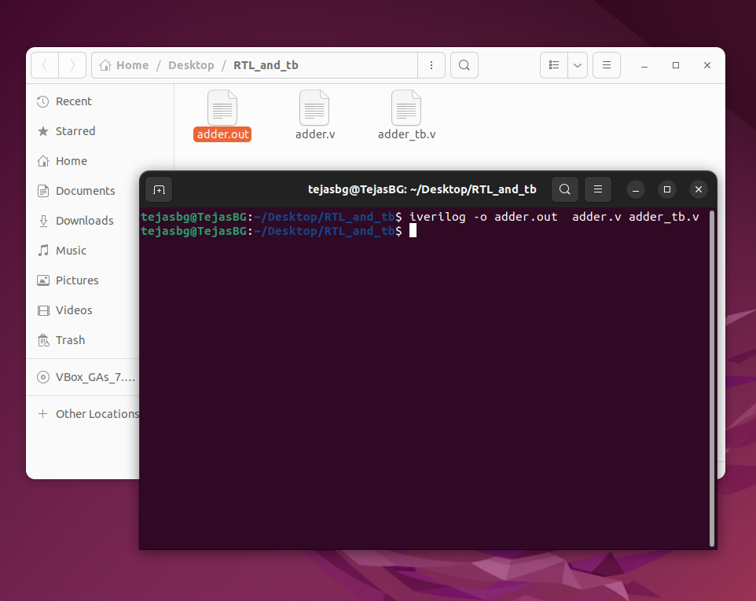

# Day-01: Introduction to RTL Design Simulation & Synthesis

Simulation is the process of using software tools to mimic and verify the behavior of a digital circuit described in RTL (usually Verilog or VHDL), before hardware is built.


## Simulator 

The software tool that performs the simulation. The Icarus Verilog simulator will be used for simulation.


## Test Bench
A testbench is a special piece of HDL code written to provide input stimuli and check outputs of the DUT (Design Under Test).

---


# Simulating a Design Using Icarus Verilog
> iverilog tool is required, Instructions to install Icarus Verilog are provided in [Week0 repo](https://github.com/tejasbg19/India_riscV_SoC_tapeout/blob/main/Week0/Week0.md)
> Also a text editor is needed to write/edit/view design & test bench files. Gedit is used, which can be installed using `$ sudo apt install gedit`

The reader may create a personal directory, add their own Verilog modules and corresponding testbenches, and follow the instructions below to perform simulations. Alternatively, the reader can clone the repository provided by Kunal Sir [click here](https://github.com/kunalg123/sky130RTLDesignAndSynthesisWorkshop), which contains ready-made design files and testbenches, and simulate them directly.


```bash
$ mkdir RTL_and_tb
$ cd RTL_and_tb
$ gedit adder.v adder_tb.v  
```


Then the user can write and save their Verilog and testbench files. Alternatively, the user can copy/paste the codes available in the [Day-01](./Day-01/RTL_and_tb) folder of this repository.


## Default Compilation

```bash
$ iverilog adder.v adder_tb.v
$ vvp a.out  # or ./a.out
```
- This compiles the Verilog files and generates the default executable `a.out`.
- Running `vvp a.out` or `./a.out` executes the simulation and typically creates a Value Change Dump (VCD) file (e.g., `dump.vcd`) if the testbench includes VCD dump commands.

<div align="center">
  
</div>


## Compiling with a Custom Output Name

```bash
$ iverilog -o adder adder.v adder_tb.v
$ vvp adder
```

- The `-o ` option lets the user to specify a custom name for the output simulation executable.
- Run the executable as `vvp adder` to start simulation.


# Viewing the Waveform with GTKWave

If the simulation generates a `.vcd` file (waveform dump), the user can view it using GTKWave:

```bash
$ gtkwave Wave.vcd  # if custom name is given then use custom_name.vcd
```

- This opens the GTKWave GUI, where the user can inspect signals, add variables to the waveform viewer, and debug their design interactively.


