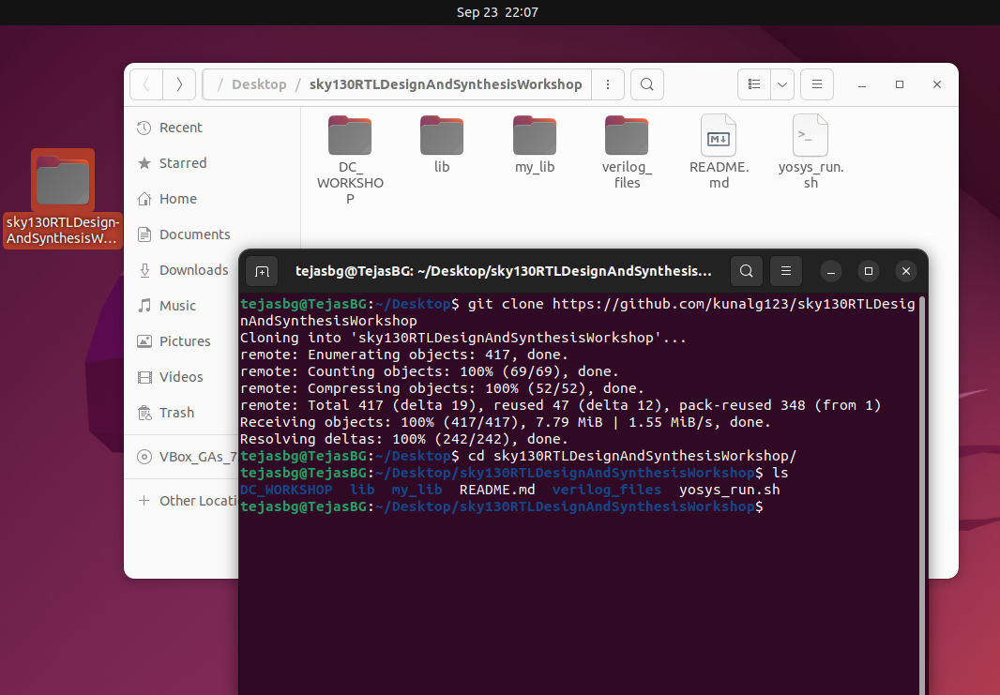

# Day-01: Introduction to RTL Design Simulation & Synthesis

Simulation is the process of using software tools to mimic and verify the behavior of a digital circuit described in RTL (usually Verilog or VHDL), before hardware is built.


## Simulator 

The software tool that performs the simulation. The Icarus Verilog simulator will be used for simulation.


## Test Bench
A testbench is a special piece of HDL code written to provide input stimuli and check outputs of the DUT (Design Under Test).

---


# Simulating a Design Using Icarus Verilog
> iverilog tool is required, Instructions to install Icarus Verilog are provided in [Week0 repo](https://github.com/tejasbg19/India_riscV_SoC_tapeout/blob/main/Week0/Week0.md)
> Also a text editor is needed to write/edit/view design & test bench files. Gedit is used, which can be installed using `$ sudo apt install gedit`

The reader may create a personal directory, add their own Verilog modules and corresponding testbenches, and follow the instructions below to perform simulations. Alternatively, the reader can clone the repository provided by Kunal Sir [click here](https://github.com/kunalg123/sky130RTLDesignAndSynthesisWorkshop), which contains ready-made design files and testbenches, and simulate them directly.


```bash
$ mkdir RTL_and_tb
$ cd RTL_and_tb
$ gedit adder.v adder_tb.v  
```


Then the user can write and save their Verilog and testbench files. Alternatively, the user can copy/paste the codes available in the [Day-01](./Day-01/RTL_and_tb) folder of this repository.
<div align="center">
  
</div>

## Default Compilation

```bash
$ iverilog adder.v adder_tb.v
$ vvp a.out  # or ./a.out
```
- This compiles the Verilog files and generates the default executable `a.out`.
- Running `vvp a.out` or `./a.out` executes the simulation and typically creates a Value Change Dump (VCD) file (e.g., `dump.vcd`) if the testbench includes VCD dump commands.

<div align="center">
  
</div>


## Compiling with a Custom Output Name

```bash
$ iverilog -o adder adder.v adder_tb.v
$ vvp adder
```

- The `-o ` option lets the user to specify a custom name for the output simulation executable.
- Run the executable as `vvp adder` to start simulation.

<div align="center">
  
</div>


# Viewing the Waveform with GTKWave

If the simulation generates a `.vcd` file (waveform dump), the user can view it using GTKWave:

```bash
$ gtkwave Wave.vcd  # if custom name is given then use custom_name.vcd
```

- This opens the GTKWave GUI, where the user can inspect signals, add variables to the waveform viewer, and debug their design interactively.

<div align="center">
  
</div>


<div align="center">
  
</div>

- A full Adder was implemented & simulated whose output can be verified in the thus generated `.vcd` file using `gtkwave`.


---
---

# Synthesis

Synthesis is the process of converting a high-level hardware description (written in RTL using Verilog or VHDL) into a gate-level representation that can be mapped onto real hardware such as ASICs or FPGAs.  
It transforms abstract RTL code into a **netlist** consisting of logic gates and flip-flops based on a given standard cell library.


## Synthesizer

The software tool that performs synthesis is called a **synthesizer**.  
It takes RTL code as input and produces a gate-level netlist as output. The Yosys will be used for synthesyzing the given design.


<div align="center">
  
</div>


---

# Synthesizing Using Yosys

Yosys requires **standard cell libraries** in the form of `.lib` files to perform technology mapping during synthesis.  
These libraries define the timing, area, and functionality of the cells that will be used in the synthesized netlist.

For this workshop, the required `.lib` files can be obtained by cloning the repository provided by [Kunal Ghosh Sir](https://github.com/kunalg123/sky130RTLDesignAndSynthesisWorkshop), as shown below:

```bash
# Navigate to a preferred directory (e.g., Desktop)
$ git clone https://github.com/kunalg123/sky130RTLDesignAndSynthesisWorkshop
$ cd sky130RTLDesignAndSynthesisWorkshop
```
<div align="center">
  
</div>


<div align="center">
  
</div>


As seen in the cloned directory:

- The folder `lib` contains the **Liberty file** `sky130_fd_sc_hd__tt_025C_1v80.lib`, which will be passed to Yosys for mapping the standard cells of the **SkyWater 130nm PDK**.  
- The folder `verilog_files` provides various example designs such as `mux.v`, `demux.v`, and `counter.v`.  


<div align="center">
  
</div>


The user can either synthesize any of these example `.v` files or create their own Verilog design. During synthesis, the absolute path of the Liberty file must be provided to Yosys to correctly map the RTL to technology-specific standard cells. Alternatively, the user can copy the `.lib` file into the directory containing their design files and pass it directly to Yosys for synthesis.


## Steps to Synthesize a Verilog File in Yosys

  The typical flow for synthesizing an RTL Verilog design using Yosys is as follows:
  
  1. **Read the standard cell library (.lib)**  
     This allows Yosys to know the timing, area, and functionality of the available cells.  
  
  2. **Read the RTL Verilog design (.v)**  
     Load the user's design into Yosys for synthesis.  
  
  3. **Set the top module**  
     Specify which module is the top-level module for synthesis.  
  
  4. **Run synthesis**  
     Use Yosys synthesis commands to map RTL to the technology library.
  
  5. **Technology Mapping**   
     Maps the synthesized generic gates to given technology standard cells. 
  
  6. **Write the gate-level netlist**  
     Export the synthesized design as a Verilog netlist or other formats (e.g., JSON, BLIF).  
  
  7. **Optionally view the design graphically**  
     Yosys can generate a graphical representation of the netlist for verification.

<!-- ---

## Bash Commands for Each Step  -->

```bash
$ read_liberty -lib /path/to/sky130_fd_sc_hd__tt_025C_1v80.lib   
$ read_verilog my_design.v                                  
$ hierarchy -top top_module_name
$ synth -top top_module_name
$ abc -liberty path/to/library.lib
$ write_verilog my_design_netlist.v  # if the netlist looks complicated used -noattr flag to remove yosys internal attributes
$ show
```


