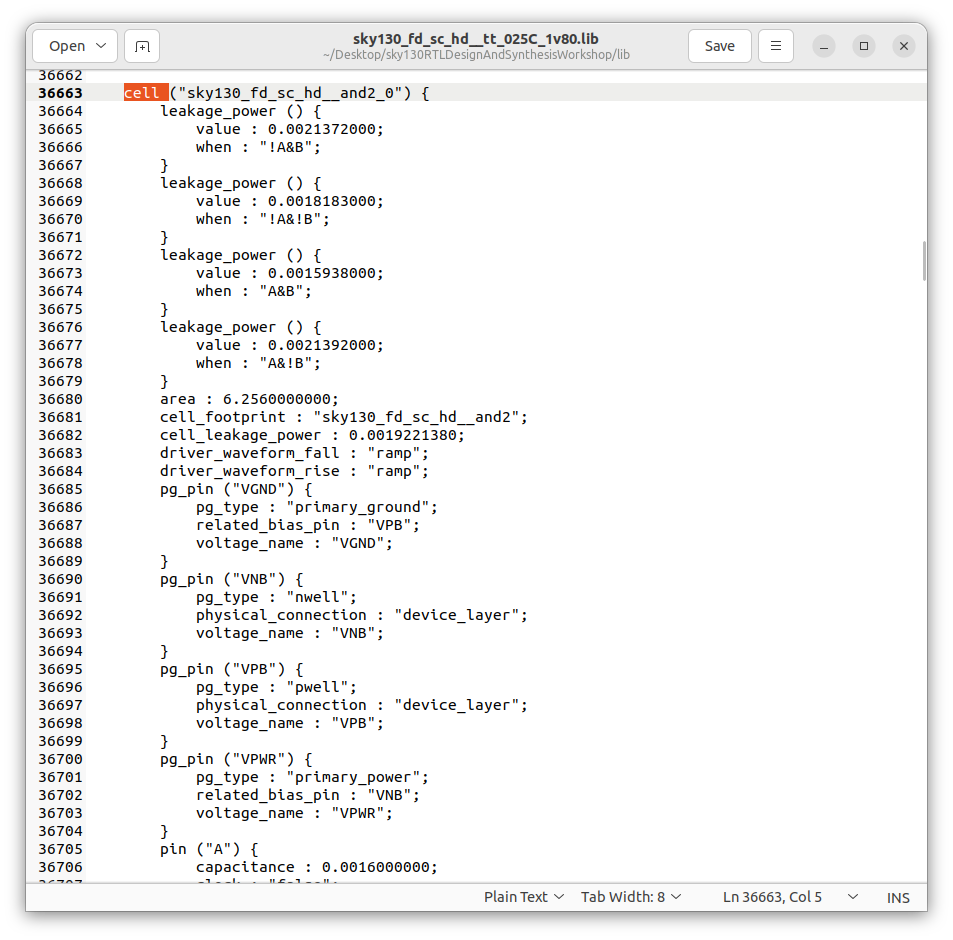

# Day-02: Understanding the Library File, Flat & Hierarchical Synthesis, and Coding Flip-Flops

## 📌 Introduction
In digital VLSI design, synthesis tools require **technology-specific information** to map RTL (Register Transfer Level) code into physical standard cells.  
This information is stored inside a **Library File** (commonly in `.lib` format).  
The user’s synthesis tool (like **Yosys**) refers to this file to understand how each standard cell behaves, its delay, power, and functional details.

---

## 📂 What is a Library File?
- A **Library File** (usually a `.lib` file, also called a **Liberty file**) provides:
  - Functional behavior of each cell (e.g., AND, OR, NAND, Flip-Flops).
  - **Timing information** (propagation delay, setup/hold times).
  - **Capacitance details** (input capacitance, output load handling).
  - **Power consumption** (dynamic + leakage).
  - **Area information** (how much silicon space each cell occupies).

📌 In short: the `.lib` file tells the synthesis tool **which cells exist, how they behave, and their performance trade-offs**.

  
  
<b>sky130_fd_sc_hd__tt_025C_1v80.lib</b>

  
  
<b>Contents of the library file</b>

The user can find the `sky130_fd_sc_hd__tt_025C_1v80.lib` by [clicking here](../Day-01/RTL_and_tb/sky130_fd_sc_hd__tt_025C_1v80.lib).

---

## 🔧 Drive Strengths and Cell Variants
Standard cells come in **different drive strengths**.  
- Example: `and2_0`, `and2_1`, `and2_3` → all are 2-input AND gates, but with increasing **drive capability**.  
- Higher drive strength means:
  - Can drive **larger loads** (more fanout or bigger capacitance).
  - Consumes more **power** and **area**.
  - Helps meet **timing requirements** when signals must travel faster.

### 🖼 Example: Different Drive Strengths of AND Gate
| AND gate with smallest drive strength (X1) | AND gate with higher drive strength (X2) | AND gate with highest drive strength (X3) |
|--------------------------------------------|------------------------------------------|-------------------------------------------|
|  |  |  |

👉 The user can choose between smaller and larger cells during synthesis, depending on **timing, power, and area constraints**.

---

## 🌡 PVT (Process, Voltage, Temperature) Corners
Real silicon doesn’t behave the same under all conditions.  
To ensure reliable chips, libraries are provided for different **PVT corners**:

- **Process (P):** Variations in transistor fabrication (e.g., Fast, Slow, Typical).  
- **Voltage (V):** Operating voltage variations (e.g., 1.6V, 1.8V, 1.95V).  
- **Temperature (T):** Operating temperature range (e.g., -40°C to 125°C).  

### Common Corners:
- **tt_025C_1v80** → Typical process, 25°C, 1.80V.  
- **ss_125C_1v60** → Slow process, Hot (125°C), Low voltage (1.60V).  
- **ff_n40C_1v95** → Fast process, Cold (-40°C), High voltage (1.95V).  

📌 The user’s synthesis tool must consider the correct **PVT corner** to ensure the design works across **all real-world conditions**.

---

## 📜 Understanding `sky130_fd_sc_hd__tt_025C_1v80.lib`

Let’s break down the name step by step:

- **sky130** → Refers to the **SkyWater 130nm process node**.  
- **fd** → *Foundry Design* (indicates this is a foundry-provided library).  
- **sc_hd** → *Standard Cell – High Density* (optimized for smaller area, may trade off speed).  
- **tt** → *Typical-Typical* (transistor models are at typical process variation).  
- **025C** → Operating at **25°C temperature**.  
- **1v80** → Nominal supply voltage of **1.80V**.  

So this file describes:  
👉 A **Sky130 process standard cell library**, high-density flavor, characterized at **typical process, 25°C, 1.80V**. To know more [click here](./pvt.md)

---
## 🔄 Flat vs Hierarchical Synthesis

### Definition
- **Flat Synthesis:** The tool flattens all RTL hierarchies into a single module and synthesizes everything together.  
- **Hierarchical Synthesis:** Modules are synthesized separately; submodule instances can be reused without re-synthesis, Basically the hierarchy is preserved.

### Yosys Support
- Yosys supports both **flat** and **hierarchical synthesis**.  
- The user can pass multiple Verilog files or even single file containing all submodules for hierarchical modules.  
- Supports **submodule-level synthesis** (synthesizing a module once and reusing it multiple times).

### Why Submodule Synthesis?
1. **Resource Efficiency:** If a module is instantiated multiple times, synthesizing it once saves time and resources.  
2. **Divide & Conquer:** Large designs can be broken into smaller modules for easier synthesis and debugging.

### Fly Synthesis
- Another term for **on-the-fly or incremental synthesis**.  
- Only re-synthesizes modified modules instead of the full design.

Users can use the `multiple_modules` Verilog file provided in `verilog_files` of the [Kunal Sir repo](<link-to-be-added>) or simply clone this repo and use the `two_adder.v` file found under the `Day-01/RTL_and_tb/` directory.

---

## Steps involving Hierarchical Synthesis

1. Read library file  
2. Read all Verilog files  
3. Synthesize design (set `-top` to the desired module)
4. Write netlist
5. Show schematic  

---

### Example: Hierarchical synthesis of a 2-bit Adder constructed by instantiating two full adders

| Full Adder Code | 2-bit Adder Code | File Organization |
|-----------------|------------------|-------------------|
|  |  |  |

**Step Outputs:**

-   
-   
-   
-   

---

## Steps involving Flat Synthesis

1. Read library file  
2. Read all Verilog files  
3. Synthesize design (set `-top` to the desired module with flattening enabled)
4. Use flattening flag
5. Write netlist
6. Show schematic  

---

### Example: Flat synthesis of a 2-bit Adder constructed by instantiating two full adders

**Step Outputs:**

-   
-   
-   
-   

---

## ⚡ NAND-based Implementation
- Yosys often maps logic to **NAND/NOR/INV primitives**, primarily **NAND**.  
- Reason:  
  - NAND gates are **fast, area-efficient, and easy to drive**.  
  - Simplifies technology mapping and standard cell selection.  
  - NOR could also be used, but NAND is generally preferred in CMOS logic.

