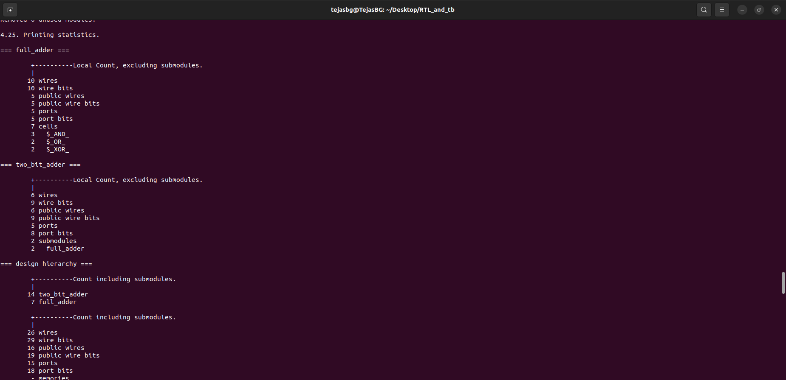

# Day-02: Understanding the Library File, Flat & Hierarchical Synthesis, and Coding Flip-Flops

## 📌 Introduction
In digital VLSI design, synthesis tools require **technology-specific information** to map RTL (Register Transfer Level) code into physical standard cells.  
This information is stored inside a **Library File** (commonly in `.lib` format).  
The user’s synthesis tool (like **Yosys**) refers to this file to understand how each standard cell behaves, its delay, power, and functional details.

---

## 📂 What is a Library File?
- A **Library File** (usually a `.lib` file, also called a **Liberty file**) provides:
  - Functional behavior of each cell (e.g., AND, OR, NAND, Flip-Flops).
  - **Timing information** (propagation delay, setup/hold times).
  - **Capacitance details** (input capacitance, output load handling).
  - **Power consumption** (dynamic + leakage).
  - **Area information** (how much silicon space each cell occupies).

📌 In short: the `.lib` file tells the synthesis tool **which cells exist, how they behave, and their performance trade-offs**.

<div align="center">
  
  <p><b>sky130_fd_sc_hd__tt_025C_1v80.lib</b></p>
</div>

<div align="center">
  
  <p><b>Contents of the library file</b></p>
</div>

The user can find the `sky130_fd_sc_hd__tt_025C_1v80.lib` by [clicking here](../Day-01/RTL_and_tb/sky130_fd_sc_hd__tt_025C_1v80.lib).

---

## 🔧 Drive Strengths and Cell Variants
Standard cells come in **different drive strengths**.  
- Example: `and2_0`, `and2_1`, `and2_3` → all are 2-input AND gates, but with increasing **drive capability**.  
- Higher drive strength means:
  - Can drive **larger loads** (more fanout or bigger capacitance).
  - Consumes more **power** and **area**.
  - Helps meet **timing requirements** when signals must travel faster.

### 🖼 Example: Different Drive Strengths of AND Gate
| AND gate with smallest drive strength (X1) | AND gate with higher drive strength (X2) | AND gate with highest drive strength (X3) |
|--------------------------------------------|------------------------------------------|-------------------------------------------|
|  |  |  |

👉 The user can choose between smaller and larger cells during synthesis, depending on **timing, power, and area constraints**.

---

## 🌡 PVT (Process, Voltage, Temperature) Corners
Real silicon doesn’t behave the same under all conditions.  
To ensure reliable chips, libraries are provided for different **PVT corners**:

- **Process (P):** Variations in transistor fabrication (e.g., Fast, Slow, Typical).  
- **Voltage (V):** Operating voltage variations (e.g., 1.6V, 1.8V, 1.95V).  
- **Temperature (T):** Operating temperature range (e.g., -40°C to 125°C).  

### Common Corners:
- **tt_025C_1v80** → Typical process, 25°C, 1.80V.  
- **ss_125C_1v60** → Slow process, Hot (125°C), Low voltage (1.60V).  
- **ff_n40C_1v95** → Fast process, Cold (-40°C), High voltage (1.95V).  

📌 The user’s synthesis tool must consider the correct **PVT corner** to ensure the design works across **all real-world conditions**.

---

## 📜 Understanding `sky130_fd_sc_hd__tt_025C_1v80.lib`

Let’s break down the name step by step:

- **sky130** → Refers to the **SkyWater 130nm process node**.  
- **fd** → *Foundry Design* (indicates this is a foundry-provided library).  
- **sc_hd** → *Standard Cell – High Density* (optimized for smaller area, may trade off speed).  
- **tt** → *Typical-Typical* (transistor models are at typical process variation).  
- **025C** → Operating at **25°C temperature**.  
- **1v80** → Nominal supply voltage of **1.80V**.  

So this file describes:  
👉 A **Sky130 process standard cell library**, high-density flavor, characterized at **typical process, 25°C, 1.80V**. To know more [click here](./pvt.md)

---
## 🔄 Flat vs Hierarchical Synthesis

### Definition
- **Flat Synthesis:** The tool flattens all RTL hierarchies into a single module and synthesizes everything together.  
- **Hierarchical Synthesis:** Modules are synthesized separately; submodule instances can be reused without re-synthesis, Basically the hierarchy is preserved.

### Yosys Support
- Yosys supports both **flat** and **hierarchical synthesis**.  
- The user can pass multiple Verilog files or even single file containing all submodules for hierarchical modules.  
- Supports **submodule-level synthesis** (synthesizing a module once and reusing it multiple times).

### Why Submodule Synthesis?
1. **Resource Efficiency:** If a module is instantiated multiple times, synthesizing it once saves time and resources.  
2. **Divide & Conquer:** Large designs can be broken into smaller modules for easier synthesis and debugging.

### Fly Synthesis
- Another term for **on-the-fly or incremental synthesis**.  
- Only re-synthesizes modified modules instead of the full design.


Users can use the `multiple_modules` Verilog file provided in `verilog_files` of the [Kunal Sir repo](https://github.com/kunalg123/sky130RTLDesignAndSynthesisWorkshop) or simply clone this repo and use the `two_adder.v` file found under the `RTL_and_tb` directory.

---

## Steps involving Hierarchical Synthesis After invoking Yosys

1. Read library file  
2. Read all Verilog files  
3. Synthesize design (set `-top` to the desired module)
4. Perform Technology mapping
5. Write netlist
6. Show schematic  

---

```bash
$ read_liberty -lib /path/to/sky130_fd_sc_hd__tt_025C_1v80.lib
$ read_verilog main_module.v submodule.v
$ synth -top top_module_name
$ abc -liberty path/to/library.lib
$ write_verilog -noattr my_design_netlist.v
$ show top_module_name
# to save the graphical schemtaic in png formate in the present working directory use $ show -format png -prefix./<name_u_want> top_module_name
$ exit       # to exit yosys.   
```

### Example: Hierarchical synthesis of a 2-bit Adder constructed by instantiating two full adders

| Full Adder Code | 2-bit Adder Code | 
|-----------------|------------------|
|  |  | 

**Step Outputs:**

<div align="center">
  
  <p><b>Library file & both Verilog files read</b></p>
</div>

<br><br>

<div align="center">
  
  <p><b>Total Number of Generic Logic Cells Used</b></p>
</div>

<br><br>

<div align="center">
  
  <p><b>Hierarchy as infered by Yosys</b></p>
</div>

<br><br>

<div align="center">
  
  <p><b>Technology mapped Cells</b></p>
</div>

<br><br>

<div align="center">
  
  <p><b>Synthesized Netlist Retaining its Hierarchical Structure </b></p>
</div>

<br><br>

<div align="center">
  
  <p><b>Graphical Representation of Synthesized Netlist</b></p>
</div>


---

## Steps involving Flat Synthesis After invoking Yosys

1. Read library file  
2. Read all Verilog files  
3. Use flattening flag
4. Synthesize design (set `-top` to the desired module with flattening enabled)
5. Perform Technology mapping
6. Write netlist
7. Show schematic


```bash
$ read_liberty -lib /path/to/sky130_fd_sc_hd__tt_025C_1v80.lib
$ read_verilog main_module.v submodule.v
$ synth -top top_module_name
$ abc -liberty path/to/library.lib
$ write_verilog -noattr my_design_netlist.v
$ show top_module_name
# to save the graphical schemtaic in png formate in the present working directory use $ show -format png -prefix./<name_u_want> top_module_name
$ exit       # to exit yosys.   
```


---

### Example: Flat synthesis of a 2-bit Adder constructed by instantiating two full adders

**Step Outputs:**

<div align="center">
  
  <p><b>Yosys Invodes, Library & Verilog files read and flatten command used </b></p>
</div>

<br><br>

<div align="center">
  
  <p><b>Technology mapped Cells</b></p>
</div>

<br><br>

<div align="center">
  
  <p><b>Flat Synthesized Netlist </b></p>
</div>

<br><br>

<div align="center">
  
  <p><b>Graphical Representation of Synthesized "flattened" Netlist</b></p>
</div>


---

## ⚡ NAND-based Implementation  

Yosys often maps synthesized logic to **NAND / NOR / INV primitives**, with a strong preference for **NAND gates**.  

### 🔑 Why NAND is preferred:  


| 2-Input NAND | 2-INPUT NOR | 
|-----------------|------------------|
|  |  |


- ✅ **Speed & Area Efficiency** – NAND gates are generally faster and more area-efficient than equivalent NOR gates.  
- ✅ **Technology Mapping** – Standard cell libraries are rich in NAND variants, simplifying mapping during synthesis.  
- ✅ **Logical Effort Advantage** – NAND gates have lower logical effort compared to NOR gates of the same drive strength.  
- ✅ **CMOS Design Consideration** –  
  - In CMOS, as the number of inputs increases, the PMOS stack grows, leading to higher input capacitance and slowing down the circuit.  
  - Attempting to increase speed by upsizing PMOS transistors consumes more silicon area.  
  - NAND structures balance this trade-off more efficiently than NOR structures.  

👉 Hence, NAND becomes the **go-to primitive** for efficient digital logic implementation in synthesis flows.  

---

## 🌀 Flip-Flop Coding & Optimization  

Flip-flops are the fundamental **sequential elements** in digital design. Unlike combinational logic, which reacts instantly to input changes, flip-flops **store state information** and update their outputs based on a clock edge.  

### 🔧 Why Do We Need Flip-Flops?  
- ✅ To **avoid glitches** caused by propagation delays in combinational paths.  
- ✅ To **synchronize signals** with the clock and ensure predictable timing.  
- ✅ To **break long combinational paths** and improve timing closure in synthesis.  

Without proper initialization, flip-flops may power up in an **unknown state**, driving garbage into the combinational logic → producing garbage outputs.  
Hence, **reset (or set) signals are essential** for reliable initialization.  

---

### ⚠️ Glitches & Propagation Delays  
- In pure combinational logic, signals may glitch due to **unequal path delays**.  
- Flip-flops act as **sampling points** that capture only the final stable value on the clock edge, avoiding intermediate glitches.  
- Reset/Set ensures **deterministic startup values**, preventing unpredictable behavior at power-up.


---

### 📌 Why Mostly D Flip-Flops (DFFs)?  
- Simpler design: only **one input (D)** apart from clock/reset, which directly represents the value to be stored.  
- Easy to infer from RTL and widely supported by synthesis tools.  
- Other flip-flops (JK, T, SR) can be implemented using DFFs with additional combinational logic.  
- Industry-standard cell libraries primarily provide **DFF variants** (with/without reset/set).  

👉 That’s why when we say "flip-flops" in RTL coding, we usually mean **DFFs**.  

---

### ⚙️ Steps Involved in Synthesizing Flip-Flops in Yosys

The process of synthesizing **flip-flops** in Yosys is similar to combinational circuits, but with special attention to **sequential elements** like clock, reset, and set pins. Users can use the various types of Flop files provided in `verilog_files` of the [Kunal Sir repo](https://github.com/kunalg123/sky130RTLDesignAndSynthesisWorkshop) to simulate & synthesize flops.

1. **Read the Technology Library**  
   Load the appropriate `.lib` file (e.g., `sky130_fd_sc_hd__tt_025C_1v80.lib`).

2. **Read the Verilog RTL Code**  
   Provide the RTL file(s) containing the flip-flop descriptions (DFF, sync/asyn reset/set, etc.).

3. **Set the Top Module**  
   Define which module to treat as the top-level (e.g., `dff`, `dff_async_reset`, etc.).

4. **Synthesize the Design**  
   Run the `synth` command to perform RTL-to-gate-level conversion.

5. **Technology Mapping**  
   Use `dfflibmap` to map generic flip-flops to the corresponding standard cell DFFs in the technology library.

6. **Optimize with ABC**  
   Invoke `abc` for logic optimization and technology mapping.

7. **Write Out Netlist**  
   Export the final gate-level netlist using `write_verilog`.

8. **Visualize if Needed**  
   Use `show` to generate a schematic of the synthesized design.

```bash
$ read_liberty -lib /path/to/sky130_fd_sc_hd__tt_025C_1v80.lib
$ read_verilog main_module.v submodule.v
$ synth -top top_module_name
$ dfflibmap -liberty path/to/library.lib
$ abc -liberty path/to/library.lib
$ write_verilog -noattr my_design_netlist.v
$ show top_module_name
# to save the graphical schemtaic in png formate in the present working directory use $ show -format png -prefix./<name_u_want> top_module_name
$ exit       # to exit yosys.   
```

---

### 📘 Types of Flip-Flop Implementations  

1. **Simple DFF** 
   - There is no reset or set pins.
   - The output Q = D at posedge of Clock
   - This type of code is coded as below
    ```verilog
      module dff_simple (input  wire clk, input  wire d, output reg  q);
      always @(posedge clk)
      begin
        q <= d;   
      end
      endmodule
    ```
 
  <div align="center">
  
  <p><b>Graphical Representation of Synthesized Simple DFF</b></p>
</div>

<br><br>

---
2. **DFF with Synchronous Reset**  
   - Reset happens **only at the clock edge**.  
   - Common in FPGA designs where asynchronous signals are discouraged.

   ```verilog
     module dff_sync_reset (input wire clk, input wire rst, input wire d, output reg q);
     always @(posedge clk)
       begin
        if (rst)
          q <= 1'b0;
        else
          q <= d;
        end
     endmodule
   ```

  <div align="center">
  
  <p><b>Simulation of DFF with Synchronous Reset</b></p>
</div>

<br><br>

<div align="center">
  
  <p><b>Output being undeterministic as the FF was not initialized in the begining</b></p>
</div>

<br><br>

<div align="center">
  
  <p><b>Even tough reset = 1 the output Q becomes 1 only at the posedge of clk</b></p>
</div>

<br><br>

<div align="center">
  
  <p><b>Graphical Representation of Synthesized DFF with Synchronous Reset</b></p>
</div>

<br><br>

---

3. **DFF with Synchronous Set**  
   - Similar to synchronous reset, but output is forced to `1` on set condition.

   ```verilog
    module dff_sync_set (input wire clk, input wire set, input wire d, output reg q);
    always @(posedge clk)
       begin
        if (set)
          q <= 1'b1;
        else
          q <= d;
       end
    endmodule

   ```


<div align="center">
  
  <p><b>Graphical Representation of Synthesized DFF with Synchronous Set</b></p>
</div>

<br><br>


---

4. **DFF with Asynchronous Reset**  
   - Reset happens **immediately**, independent of clock.  
   - Useful when system-wide reset must be asserted instantly.  

   ```verilog
    module dff_async_reset (input wire clk, input wire rst, input wire d, output reg q);
    always @(posedge clk or posedge rst)
     begin
        if (rst)
          q <= 1'b0;
        else
          q <= d;
     end
    endmodule
   ```

  <div align="center">
  
  <p><b>Simulation of DFF with Asynchronous Reset</b></p>
</div>

<br><br>

<div align="center">
  
  <p><b>Output being pulled to 0 the instant Reset becomes 1</b></p>
</div>

<br><br>

<div align="center">
  
  <p><b>Even tough reset becomes 0 the output Q stays low until next the posedge of clk</b></p>
</div>

<br><br>

<div align="center">
  
  <p><b>Yosys performing synthesis</b></p>
</div>

<br><br>


<div align="center">
  
  <p><b>Yosys performing Flip flop technology mapping</b></p>
</div>

<br><br>

<div align="center">
  
  <p><b>Graphical Representation of Synthesized DFF with Asynchronous reset</b></p>
</div>

<br><br>

---

5. **DFF with Asynchronous Set**  
   - Forces output to `1` immediately, regardless of clock.
  ```verilog
    module dff_async_set (input wire clk, input wire set, input wire d, output reg q);
      always @(posedge clk or posedge set)
        begin
          if (set)
            q <= 1'b1;
          else
            q <= d;
        end
    endmodule
   ```

   <div align="center">
  
  <p><b>Simulation of DFF with Asynchronous Set</b></p>
</div>

<br><br>

<div align="center">
  
  <p><b>Output being pulled to 1 the instant Set becomes 1</b></p>
</div>

<br><br>

<div align="center">
  
  <p><b>Even tough Set becomes 0 the output Q stays High until next the posedge of clk</b></p>
</div>

<br><br>


<div align="center">
  
  <p><b>Graphical Representation of Synthesized DFF with Asynchronous Set</b></p>
</div>

<br><br>

---

6. **DFF with Both Async Reset & Sync Reset**  
   - Asynchronous reset initializes the design instantly.  
   - Synchronous reset is checked at clock edge.  
   - Priority is always:  
     **Asynchronous Reset / Set > Synchronous Reset / Set > D Input**.

    ```verilog
    module dff_async_reset_sync_reset (input wire clk, input wire arst, input wire srst, input wire d, output reg q);
      always @(posedge clk or posedge arst)
        begin
          if (arst)
            q <= 1'b0;
          else if (srst)
            q <= 1'b0;
          else
            q <= d;
        end
    endmodule
   ```

  
<div align="center">
  
  <p><b>Graphical Representation of Synthesized DFF with Asynchronous Reset and Synchronous Reset</b></p>
</div>

<br><br>


---

## Multiplication Optimization in Yosys

During synthesis, it might seem that operations like multiplication require actual hardware multipliers or adders. However, for **constant multiplications**, Yosys can often optimize the logic to **simple rewiring**, avoiding unnecessary cells entirely. This significantly reduces area, power, and complexity.

---

## 🔹 Example 1: Multiply by 2

- RTL: `y = a * 2;`  
- Conceptual view: Multiplying by 2 is equivalent to **shifting left by 1 bit**.
- Hardware implication:
  - The least significant bit (LSB) is always `0`.
  - Remaining bits of `y` can be directly **wired from the input `a`**.
- Yosys synthesis:
  - Detects this pattern.
  - No gates or standard cells are required.
  - Netlist is purely rewired connections.

<div align="center">
  
  <p><b>Example: Netlist generated by Yosys for `a*2`</b></p>
</div>

---

## 🔹 Example 2: Multiply by 9

- RTL: `y = a * 9;`  
- Conceptual view: `9 = 2^3 + 1` → `a * 9 = (a << 3) + a`.
- Hardware implication:
  - One part is a **left shift** (rewire, no gates).
  - Second part is the original input (`a`) wired to respective outputs.
  - Addition can often be **optimized away** if widths allow direct concatenation.
- Yosys synthesis:
  - Recognizes constant multiplication pattern.
  - Performs **shift-and-add optimization**, often requiring zero or minimal gates.
  - ABC confirms nothing needs mapping, as the operation is purely combinational rewiring.

<div align="center">
  
  <p><b>Example: Netlist generated by Yosys for `a*9`</b></p>
</div>

---

### ⚡ Key Takeaways

1. **Constant multiplications** do not always require actual multipliers in hardware.
2. Yosys performs **pattern recognition optimizations**, translating arithmetic into:
   - Bit shifts.
   - Simple wiring.
   - Minimal combinational logic.
3. This reduces:
   - Number of gates.
   - Propagation delay.
   - Power consumption.
4. ABC integration confirms that **no standard cells are required**, making the netlist extremely efficient.
5. For designers, this demonstrates that **higher-level arithmetic operations can often be simplified automatically**, without manual intervention.

<div align="center">
  
  <p><b>ABC reports: Nothing to map – optimization completed</b></p>
</div>

---

This phenomenon is especially useful for:
- **Shift-based multiplications** (`*2`, `*4`, `*8`).
- **Constants expressible as sum of powers of 2** (`*3`, `*5`, `*9`).
- **Reducing hardware footprint** for small, fixed-function blocks.


