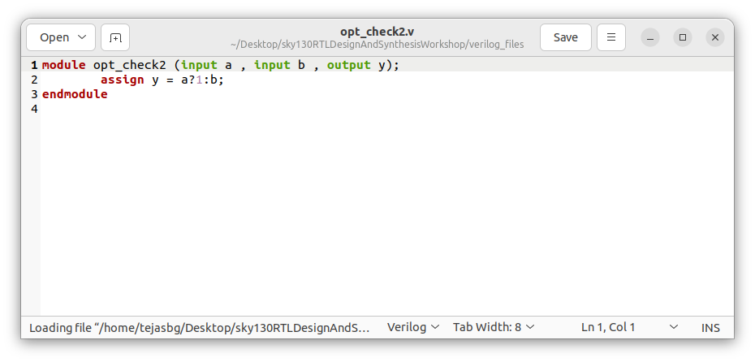
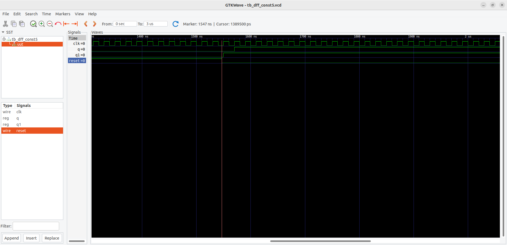

# Day-03: Combinational & Sequential Logic Optimization

## 📌 Introduction
Logic optimization is the process of transforming a digital circuit into a more efficient version without changing its functionality.  
The goals of optimization include:
- Reducing area (fewer gates, smaller silicon footprint).
- Reducing power consumption (fewer transitions, less dynamic power).
- Reducing delay (faster circuits, higher performance).
- Improving reliability (simpler designs, easier verification).

Optimization is a crucial step in digital VLSI design because even small improvements in area and power can have a huge impact in large-scale integrated circuits. The genral steps invilved in optimizing a design in yosys is given below :
```bash
$ read_liberty -lib /path/to/sky130_fd_sc_hd__tt_025C_1v80.lib
$ read_verilog main_module.v submodule.v
$ synth -top top_module_name
$ opt_clean -purge  # to optimize and remove unused nets and cells. If multiple instantion sof submodules exist before this step use flatten command
$ abc -liberty path/to/library.lib
$ write_verilog -noattr my_design_netlist.v
$ show top_module_name
# to save the graphical schemtaic in png formate in the present working directory use $ show -format png -prefix./<name_u_want> top_module_name
$ exit       # to exit yosys.   
```


---

## 🔹 Combinational Logic Optimization

### 1. Constant Propagation
**Definition:**  
When the value of an input is constant (either 0 or 1), it can be propagated through the circuit to simplify logic.

**Example:**  
- y = a AND 1 → y = a  
- y = a AND 0 → y = 0  
- y = a OR 0 → y = a  
- y = a OR 1 → y = 1  

Instead of implementing gates, synthesis tools will replace them with direct wires or constants.

---

#### 🔹Example 1 of Combinational Logic Optimization done by Yosys

<div align="center">
  
  <p><b>Verilog Code of module opt_check</b></p>
</div>
<br>

On simple observation the above RTL code should have been translated to a `Mux` but when synthesized using Yosys with the `opt_clean -purge` command it translates to a simple and gate as shown below.


<div align="center">
  
  <p><b>Yosys Invoked, liberty and verilog file passed</b></p>
</div>
<br>
<div align="center">
  
  <p><b>Number of Cells used & Optimization command given</b></p>
</div>
<br>
<div align="center">
  
  <p><b>Graphical View of Synthesized Netlist module opt_check</b></p>
</div>
<br>


---


#### 🔹Example 2 of Combinational Logic Optimization done by Yosys

<div align="center">
  
  <p><b>Verilog Code of module opt_check2</b></p>
</div>
<br>
Similarly just like example 1 due to propagation of constant 1, the `Mux` was optimized to a 2-input OR gate as show below.

<br>
<div align="center">
  
  <p><b>Graphical View of Synthesized Netlist module opt_check2</b></p>
</div>
<br>


---


#### 🔹Example 3 of Combinational Logic Optimization done by Yosys

<div align="center">
  
  <p><b>Verilog Code of module opt_check3</b></p>
</div>
<br>

Similarly just like example 1 due to propagation of constant 1, the `Mux` was optimized to a 3-input AND gate as show below.

<br>
<div align="center">
  
  <p><b>Graphical View of Synthesized Netlist module opt_check3</b></p>
</div>
<br>


---

#### 🔹Example 4 of Combinational Logic Optimization done by Yosys

<div align="center">
  
  <p><b>Verilog Code of module opt_check4</b></p>
</div>
<br>

Similarly just like example 1 due to propagation of constant 1, the `Mux` was optimized to a 2-input XNOR gate as show below.

<br>
<div align="center">
  
  <p><b>Graphical View of Synthesized Netlist module opt_check4</b></p>
</div>
<br>


---

#### 🔹Example 5 of Combinational Logic Optimization done by Yosys

<div align="center">
  
  <p><b>Verilog Code of module multiple_module_opt</b></p>
</div>
<br>

As this module contains many submodules, we must first use `flatten` command before applying the optimization code `opt_clean -purge`.

<br>
<div align="center">
  
  <p><b>Graphical View of Synthesized Netlist module multiple_module_opt</b></p>
</div>
<br>


---

#### 🔹Example 5 of Combinational Logic Optimization done by Yosys  

<div align="center">
  
  <p><b>Verilog Code of module multiple_module_opt2</b></p>
</div>
<br>

As this module contains many submodules, we must first use `flatten` command before applying the optimization code `opt_clean -purge`. despite And gates being instantiated multiple times d=through the submodules, Yosys optimized it in such a way that no logic cells were used in the final synthesized output as shown below.

<br>
<div align="center">
  
  <p><b>Graphical View of Synthesized Netlist module multiple_module_opt2</b></p>
</div>
<br>


---

### 2. Boolean Logic Optimization
**Definition:**  
Using Boolean algebra to simplify expressions and reduce the number of gates.

**Examples:**  
- Idempotent Law: `a + a = a`  
- Absorption Law: `a + (a·b) = a`, `a' + a.b = a + b` 
- Consensus Theorem: `a·b + a'·c + b·c = a·b + a'·c`

This helps eliminate redundant terms and gates.

---

### 3. Karnaugh Map (K-Map)
**Definition:**  
A graphical method of minimizing Boolean expressions for up to 5–6 variables.  
It groups adjacent 1s (minterms) into rectangles to find simplified expressions.

**Example:**  
Function: F(A,B,C) = Σ(1,3,7)  
K-map simplification → F = A'C + AB

---

### 4. Quine–McCluskey Algorithm
**Definition:**  
A tabular method of logic minimization suitable for computer implementation.  
It systematically finds prime implicants and reduces expressions.

**Example:**  
Function: F(A,B,C,D) = Σ(0,1,2,5,6,7,8,9,10,14)  
Quine–McCluskey procedure → minimal sum of products.

---

## 🔹 Sequential Logic Optimization

### 1. Sequential Constant Propagation
**Definition:**  
If a register always stores a constant (never changes during operation), the synthesis tool can replace it with a constant wire.

**Example:**  
A flip-flop that always loads 0 on every clock can be removed and replaced by a constant 0.

#### 🔹Example 1 of Sequential Logic Optimization done by Yosys

<div align="center">
  
  <p><b>Verilog Code of module dff_const1</b></p>
</div>
<br>

<div align="center">
  
  <p><b>Simulation of module dff_const1 using iverilog</b></p>
</div>
<br>

<div align="center">
  
  <p><b>Simulated waveforms of module dff_const1 in GTKwave</b></p>
</div>
<br>

<div align="center">
  
  <p><b>Yosys Invoked, liberty and verilog file passed</b></p>
</div>
<br>
<div align="center">
  
  <p><b>Number of Cells used </b></p>
</div>
<br>
<div align="center">
  
  <p><b>Graphical View of Synthesized Netlist module dff_const1</b></p>
</div>
<br>


---

#### 🔹Example 2 of Sequential Logic Optimization done by Yosys

<div align="center">
  
  <p><b>Verilog Code of module dff_const2</b></p>
</div>
<br>

<div align="center">
  
  <p><b>Simulation of module dff_const2 using iverilog</b></p>
</div>
<br>

<div align="center">
  
  <p><b>Simulated waveforms of module dff_const2 in GTKwave</b></p>
</div>

<br>
<div align="center">
  
  <p><b>Number of Cells used </b></p>
</div>
<br>
<div align="center">
  
  <p><b>Graphical View of Synthesized Netlist module dff_const2</b></p>
</div>
<br>


---

#### 🔹Example 3 of Sequential Logic Optimization done by Yosys

<div align="center">
  
  <p><b>Verilog Code of module dff_const3</b></p>
</div>
<br>

<div align="center">
  
  <p><b>Simulation of module dff_const3 using iverilog</b></p>
</div>
<br>

<div align="center">
  
  <p><b>Simulated waveforms of module dff_const3 in GTKwave</b></p>
</div>

<br>
<div align="center">
  
  <p><b>Number of Cells used </b></p>
</div>
<br>
<div align="center">
  
  <p><b>Graphical View of Synthesized Netlist module dff_const3</b></p>
</div>
<br>


---

#### 🔹Example 4 of Sequential Logic Optimization done by Yosys

<div align="center">
  
  <p><b>Verilog Code of module dff_const4</b></p>
</div>
<br>

<div align="center">
  
  <p><b>Simulation of module dff_const4 using iverilog</b></p>
</div>
<br>

<div align="center">
  
  <p><b>Simulated waveforms of module dff_const4 in GTKwave</b></p>
</div>

<br>
<div align="center">
  
  <p><b>Number of Cells used </b></p>
</div>
<br>
<div align="center">
  
  <p><b>Graphical View of Synthesized Netlist module dff_const4</b></p>
</div>
<br>


---

#### 🔹Example 5 of Sequential Logic Optimization done by Yosys

<div align="center">
  
  <p><b>Verilog Code of module dff_const5</b></p>
</div>
<br>

<div align="center">
  
  <p><b>Simulation of module dff_const5 using iverilog</b></p>
</div>
<br>

<div align="center">
  
  <p><b>Simulated waveforms of module dff_const5 in GTKwave</b></p>
</div>

<br>
<div align="center">
  
  <p><b>Number of Cells used </b></p>
</div>
<br>
<div align="center">
  
  <p><b>Graphical View of Synthesized Netlist module dff_const5</b></p>
</div>
<br>


---

### 2. State Optimization
**Definition:**  
Simplifying the state machine by removing unreachable or redundant states.  
This reduces the number of flip-flops and logic required for next-state/output decoding.

---

### 3. Retiming
**Definition:**  
The process of repositioning registers across combinational logic without changing the overall functionality.  
Goal: balance the delays across paths to improve maximum clock frequency.

---

### 4. Sequential Logic Cloning (Physical-Aware Synthesis)
**Definition:**  
When a flip-flop drives multiple far-apart logic cones, the tool may create additional "clones" of the same register placed closer to the logic blocks.  
This reduces routing delay and improves timing closure in large designs.

---
<!--
## ✅ Summary
- Combinational optimization focuses on simplification of Boolean logic (propagation, minimization).  
- Sequential optimization deals with flip-flops and state elements (constant propagation, state reduction, retiming, cloning).  
- Both are critical for reducing area, power, and delay in modern digital circuits. -->

### 5. Removal of Unused Logic
**Definition:**  
Any intermediate logic or registers that do not contribute to the final output are considered unused and are removed by the synthesis tool.  

**Example: 1**  

<div align="center">
  
  <p><b>Verilog Code of module counter_opt</b></p>
</div>

<br>

<div align="center">
  
  <p><b>Number of Cells used </b></p>
</div>
<br>
<div align="center">
  
  <p><b>Graphical View of Synthesized Netlist module counter_opt</b></p>
</div>
<br>

In the above 3-bit counter, only the least significant bit `count(0)` is assigned to the final output `q`, the logic for `count(1)` and `count(2)` is unused.  
During synthesis, these unused flip-flops and related combinational logic were pruned, reducing area and power without affecting the functionality of the design. 


---

**Example: 2**  

<div align="center">
  
  <p><b>Verilog Code of module counter_opt2</b></p>
</div>

<br>

The above verilog module is the modified version of example 1, here the all the bits of counter are used to determine the output of the module, hence there is no unused intermediate logic, hence all 3 flops will be synthesized.


<div align="center">
  
  <p><b>Number of Cells used </b></p>
</div>
<br>
<div align="center">
  
  <p><b>Graphical View of Synthesized Netlist module counter_opt2</b></p>
</div>
<br>


