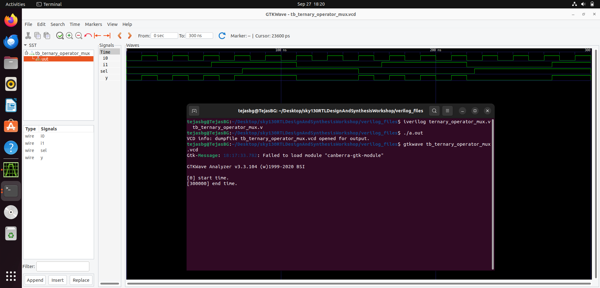
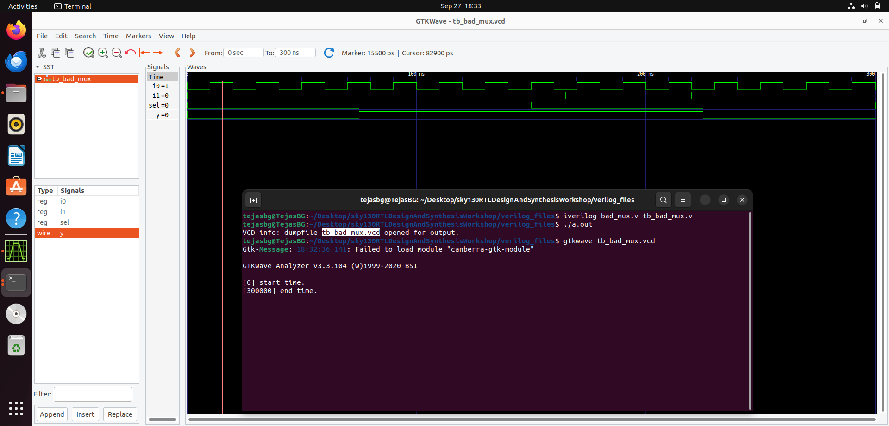

# Day-04: GLS (Gate Level Simulation), Synthesis–Simulation Mismatches, Blocking vs Non-Blocking assignments  

---

## 1. GLS (Gate Level Simulation)  

**Definition:**  
Gate Level Simulation (GLS) is the process of simulating the synthesized gate-level netlist instead of the RTL description.  

**How to do GLS in Icarus Verilog :**  
1. Write your RTL design and testbench.  
2. Synthesize the RTL with Yosys → generate gate-level netlist.  
3. Collect the following files:  
   - Testbench (`tb.v`)  
   - RTL code (`design.v`)  
   - Synthesized netlist (`netlist.v`)  
   - Primitive cells (`my_lib/verilog_model/primitives.v`)  
   - Gate-level modules from **sky130 PDK** (`my_lib/verilog_model/sky130_fd_sc_hd.v` from Kunal sir’s repo).  
4. Run `iverilog` with all the above files.  
5. Generate VCD dump and open with GTKWave.

```bash
$ iverilog design.v tb.v ../my_lib/verilog_model/sky130_fd_sc_hd.v ../my_lib/verilog_model/primitives.v
$ vvp a.out  # or ./a.out
$ gtkwave name_of_file.vcd
```
 

**Why GLS is needed?**  
- To verify functional correctness of synthesized logic.  
- To detect **synthesis–simulation mismatches**.  
- If the gate-level modules are **timing-aware**, we can also verify **timing behavior** in addition to logic.  

**GLS Verification of a Simple 2:1 Mux :**


| RTL Code of module ternary_operator_mux |  Test Bench of module ternary_operator_mux |
|--------------------------------------------|------------------------------------------|
|  |  | 
<br>

<div align="center">
  
  <p><b>RTL Simulation Output</b></p>
</div>

<br>

<div align="center">
  
  <p><b>Number & Type of Cells as Infered by Yosys</b></p>
</div>

<br>


<div align="center">
  
  <p><b>Graphical Representation of Synthesized Netlist of module ternary_operator_mux</b></p>
</div>

<br>


<div align="center">
  
  <p><b>Synthesized Netlist of module ternary_operator_mux</b></p>
</div>

<br>


<div align="center">
  
  <p><b>Gate Level Simulation of the Synthesized Netlist of module ternary_operator_mux</b></p>
</div>


---


## 2. Types of Synthesis–Simulation Mismatches  

### (a) Missing Sensitivity List  
- If a signal is missing in the sensitivity list, RTL sim behaves like a **latch**.  
- After synthesis, the same logic is implemented as a **MUX**, leading to mismatch.
- **Example :**

| RTL Code of module bad_mux |  Test Bench of module bad_mux |
|--------------------------------------------|------------------------------------------|
|  |  | 
<br>

<div align="center">
  
  <p><b>RTL Simulation Output</b></p>
</div>

<br>

As we can see even though the RTL coding style seems to be that of a `2:1 Mux`, the simulated output waveform seems to be reflecting a latched Mux where the output is sensing the input `I0` & `I1` only when there is change in state of select line `sel`. 

<div align="center">
  
  <p><b>Number & Type of Cells as Infered by Yosys</b></p>
</div>

<br>


<div align="center">
  
  <p><b>Graphical Representation of Synthesized Netlist of module bad_mux</b></p>
</div>

<br>


<div align="center">
  
  <p><b>Synthesized Netlist of module bad_mux</b></p>
</div>

<br>


<div align="center">
  
  <p><b>Gate Level Simulation of the Synthesized Netlist of module bad_mux</b></p>
</div>


---

### (b) Blocking vs Non-Blocking Assignments  

**Blocking (`=`):**  
- Executes sequentially, just like a C program.  
- Commonly used for **combinational logic**.  

**Non-Blocking (`<=`):**  
- RHS values are evaluated first, then all assignments update in parallel.  
- Commonly used for **sequential (flip-flop) logic**.
- **Example :**


### (c) Non-Standard Verilog Coding  

Some constructs simulate fine but are not synthesizable → tools either reject them or interpret differently.  

Examples (in plain text):  
- Using delays like `#5`.  
- Infinite loops without proper sensitivity list.  
- Incomplete if/else → unintended latches.  

📷 *[Insert images here: code, testbench, RTL vs netlist simulation outputs]*  

---
