# Day-05: Good & Bad Coding Practices when dealing with if-else, Case and Loops  

---

## 1. If–Else Statements  

**Introduction:**  
- The `if–elseif–else` chain is **priority-based**.  
- First condition is checked, if true it executes, otherwise moves down the chain.  
- Useful for priority encoders and similar logic.  

**Generic Syntax (text only):**  
if (condition1)  
  statement1;  
else if (condition2)  
  statement2;  
else  
  statement3;  

**Cautions / Dangers:**  
- If you forget to specify all branches, the synthesizer will infer a **latch**.  
- Latches are dangerous in synchronous designs because they cause timing and metastability issues.  

**Example 1 (incomplete if causing latch):**  

| RTL Code of module incomp_if |  Test Bench of module incomp_if |
|--------------------------------------------|------------------------------------------|
|  |  | 
<br>

<div align="center">
  
  <p><b>RTL Simulation Output</b></p>
</div>
<br>

As output is not defined for condiition when `i0 = 0` , the output latches itself to previous value of `Y` which was `1` when `i0` becomes `0`


<div align="center">
  
  <p><b>As Expected only 1 Dlatch is Infered by Yosys</b></p>
</div>

<br>


<div align="center">
  
  <p><b>Graphical Representation of Synthesized Netlist of module incomp_if</b></p>
</div>

<br>


<div align="center">
  
  <p><b>Synthesized Netlist of module incomp_if</b></p>
</div>

<br>

---

**Example 2 (incomplete if causing latch):**  

| RTL Code of module incomp_if2 |  Test Bench of module incomp_if2 |
|--------------------------------------------|------------------------------------------|
|  |  | 
<br>

<div align="center">
  
  <p><b>RTL Simulation Output</b></p>
</div>
<br>

As output is not defined for condiition when `i0 = 0` & `i2 = 0` , the output latches itself to previous value of `Y` which was `1`.

<br>

<div align="center">
  
  <p><b>RTL Simulation Output</b></p>
</div>
<br>

As output is not defined for condiition when `i0 = 0` & `i2 = 0` , the output latches itself to previous value of `Y` which was `0`.

<div align="center">
  
  <p><b>As Expected only 1 Dlatch is Infered by Yosys</b></p>
</div>

<br>


<div align="center">
  
  <p><b>Graphical Representation of Synthesized Netlist of module incomp_if2</b></p>
</div>

<br>


<div align="center">
  
  <p><b>Synthesized Netlist of module incomp_if2</b></p>
</div>

<br>

---


**Note:**  
- `if` statements and `case` statements are written **inside an always block**.  
- The variables assigned inside must be declared as **reg**.  

---

## 2. Case Statements  

**Introduction:**  
- A case statement compares an expression against multiple possible values.  
- Variants:  
  - `case` → standard case matching.  
  - `casex` → treats `x` and `z` as don’t-care during comparison.  
  - `casez` → treats `z` as don’t-care (but not `x`).  

**Generic Syntax:**  
```verilog
case (expression)  
 value1 : statement1;  
 value2 : statement2;  
 default : statementN;  
endcase
```
**Example of Complete & Good Case:**  

| RTL Code of module comp_case |  Test Bench of module comp_case |
|--------------------------------------------|------------------------------------------|
|  |  | 
<br>

<div align="center">
  
  <p><b>RTL Simulation Output of module comp_case</b></p>
</div>
<br>

As we can Infer by the above output waveform, there is no latch inferred in the above module. As there is a default statment to cover all inputs and all the outputs are defined.

---


**Important:**  
- Case must also be written inside an always block.  
- The target variables must be declared as **reg**.  

---

### Hazards / Cautions with Case  

1. **Incomplete Case:**  
   - If all possible conditions are not covered (and no `default` is present), it infers a **latch**.  
   - Example: I have simulation and synthesis images for this (will attach).  
   - **Example :**  

| RTL Code of module incomp_case |  Test Bench of module incomp_case |
|--------------------------------------------|------------------------------------------|
|  |  | 
<br>

<div align="center">
  
  <p><b>RTL Simulation Output</b></p>
</div>
<br>

As output is not defined for condiition when `2'b10` , the output latches itself to previous value of `Y` which was `0`.

<br>

<div align="center">
  
  <p><b>RTL Simulation Output</b></p>
</div>
<br>

As output is not defined for condiition when `2'b11` , the output latches itself to previous value of `Y` which was `0`.

<div align="center">
  
  <p><b>As Expected only 1 Dlatch is Infered by Yosys</b></p>
</div>

<br>


<div align="center">
  
  <p><b>Graphical Representation of Synthesized Netlist of module incomp_case</b></p>
</div>

<br>


<div align="center">
  
  <p><b>Synthesized Netlist of module incomp_case</b></p>
</div>

<br>

---


2. **Partial Assignment in Case:**  
   - If in one case branch not all variables are assigned, then the unassigned variable holds its previous value → latch inferred.  
   - **Example :**  

<div align="center">
 
  <p><b>RTL Code of module partial_case_assign</b></p>
</div>

<br>

<div align="center">
  
  <p><b>RTL Simulation Output</b></p>
</div>
<br>


<div align="center">
  
  <p><b>As Expected only a single D-latch is Infered by Yosys</b></p>
</div>

<br>


<div align="center">
  
  <p><b>Graphical Representation of Synthesized Netlist of module partial_case_assign</b></p>
</div>

<br>

---


3. **Overlapping Case:**  
   - If two or more case items overlap (like using wildcards `2'b1?`), then multiple matches may occur.  
   - This can cause unintended priority or mismatches between simulation and synthesis.  
   - **Example :**  

| RTL Code of module bad_case |  Test Bench of module bad_case |
|--------------------------------------------|------------------------------------------|
| 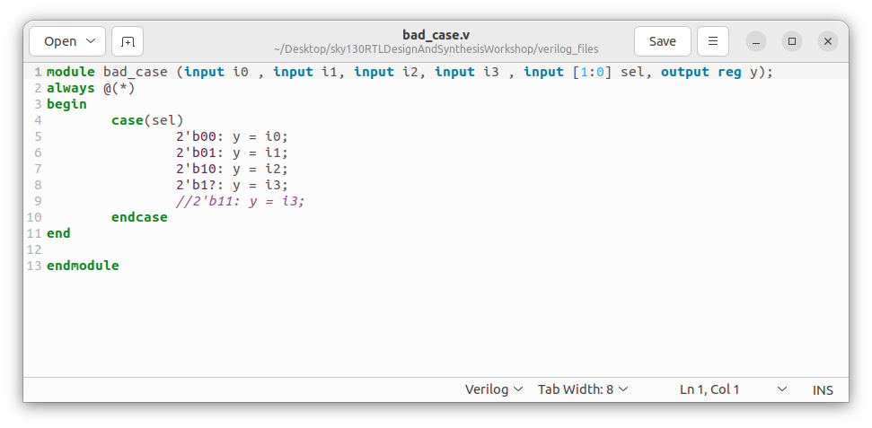 | 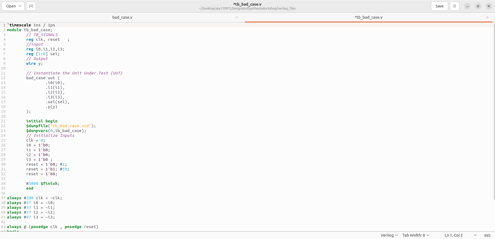 | 
<br>

<div align="center">
  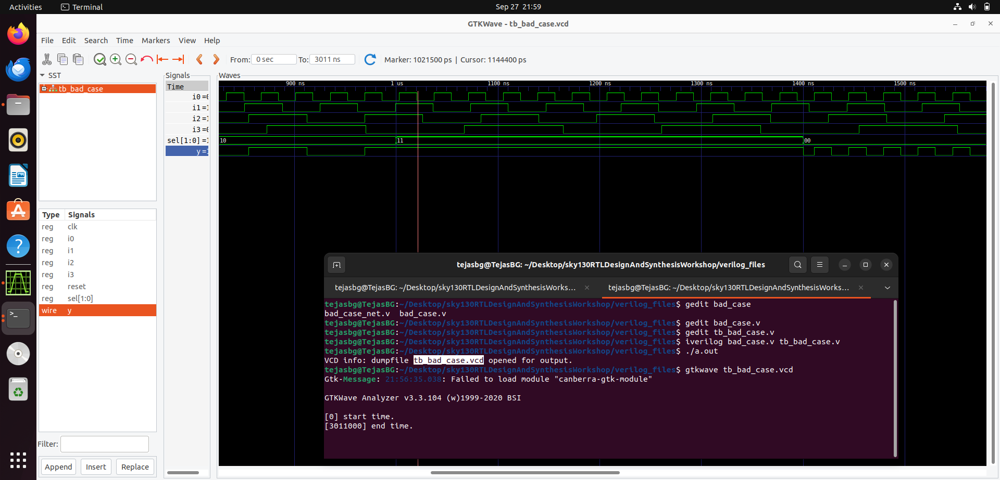
  <p><b>RTL Simulation Output</b></p>
</div>
<br>

The output for input `11` depends on the simulator & even synthesizer as this confuses compiler itself and output just latched to its previous value.

<br>

<div align="center">
  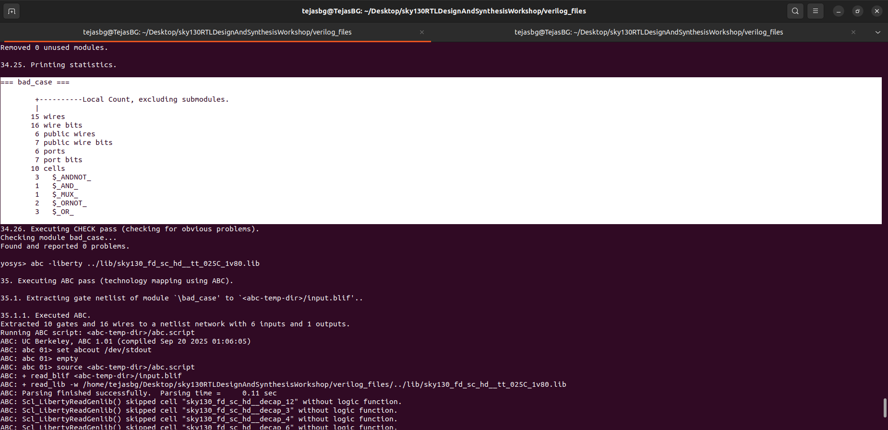
  <p><b>No Latch is Infered by Yosys</b></p>
</div>

<br>


<div align="center">
  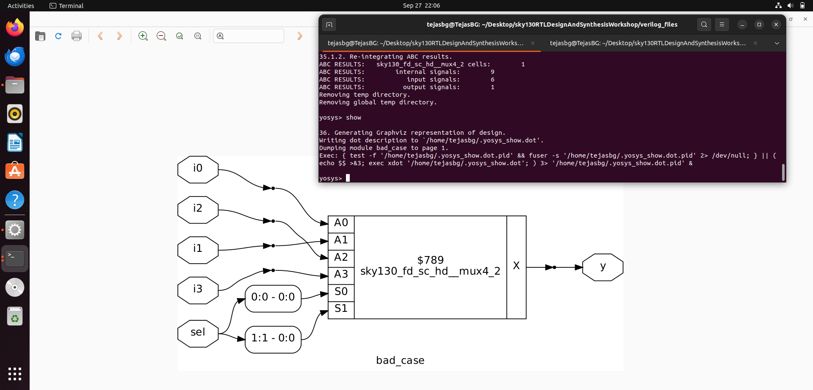
  <p><b>Graphical Representation of Synthesized Netlist of module bad_case</b></p>
</div>

<br>

<div align="center">
  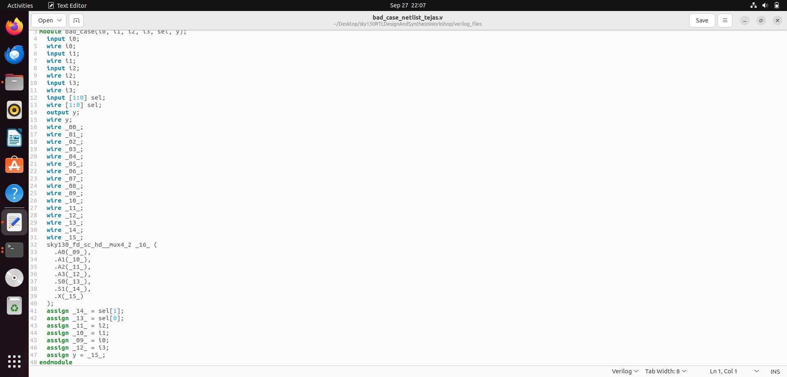
  <p><b>Synthesized Netlist of module bad_case</b></p>
</div>

<br>

<div align="center">
  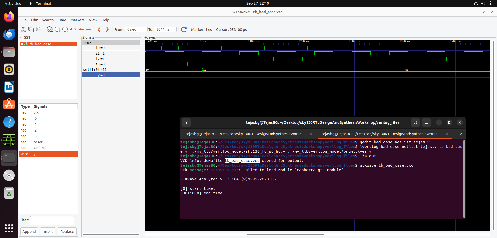
  <p><b>Gate Level Simulation output of the Synthesized Netlist</b></p>
</div>

The output for input `11` follows `i3` in the synthesized netlist simulation where as it latched to previous value of output in RTL simulation. Even tough there were no inferred latched, the overlapping cases `2'b1?` caused a Synthesis–Simulation Mismatch.

---


## 3. Looping Constructs  

In Verilog, loops are powerful tools, but they must be used carefully since hardware is not the same as software. Loops in Verilog either **evaluate expressions inside an always block** or **generate repeated hardware structures**.  

---

### (a) `for` Loop  
- **Usage:** Only allowed **inside an always block**.  
- Purpose: To perform repetitive calculations or assignments during simulation.  
- Does **not** create multiple hardware instances, only expands to repeated behavioral code.
- **Generic Syntax:**  

```verilog
always @(posedge clk) begin  
 for (i = 0; i < N; i = i + 1)  
  array[i] = array[i] + 1;  
end  
```

- **Example Synthesizing a Mux using For loop**
  
<div align="center">
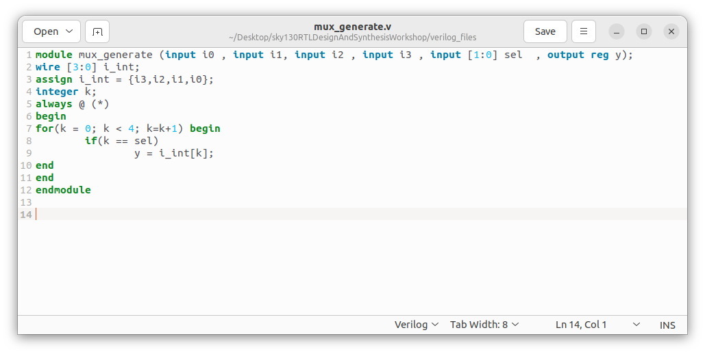 
  <p><b>RTL Code of module mux_generate</b></p>
</div>

<br>

<div align="center">
  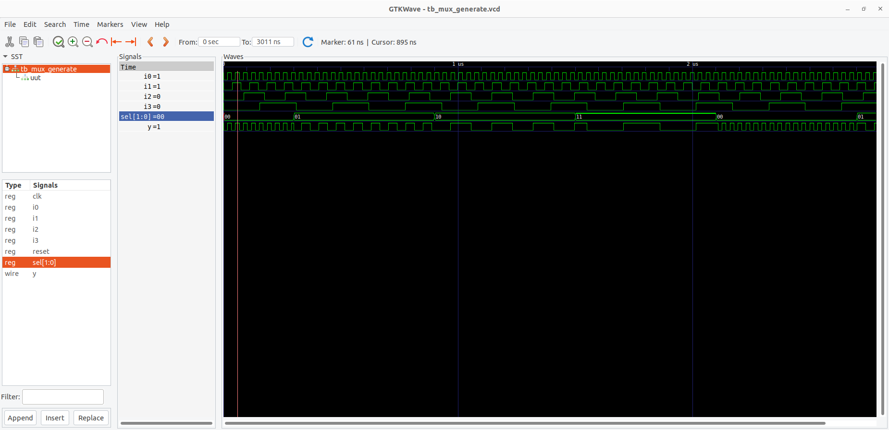
  <p><b>RTL Simulation Output matches that of 4:1 Mux</b></p>
</div>
<br>


<div align="center">
  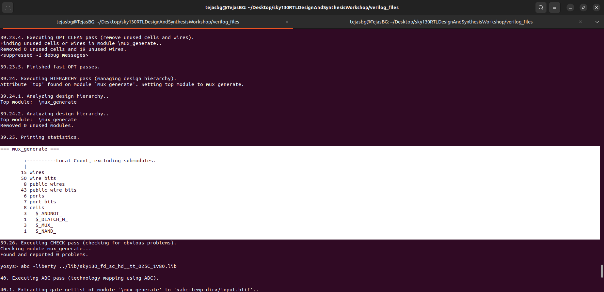
  <p><b>Cells as Infered by Yosys</b></p>
</div>

<br>


<div align="center">
  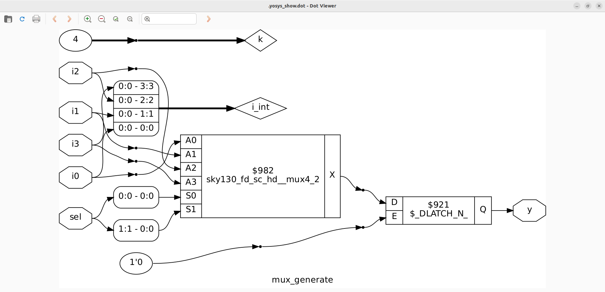
  <p><b>Graphical Representation of Synthesized Netlist of module mux_generate</b></p>
</div>

<br>


<div align="center">
  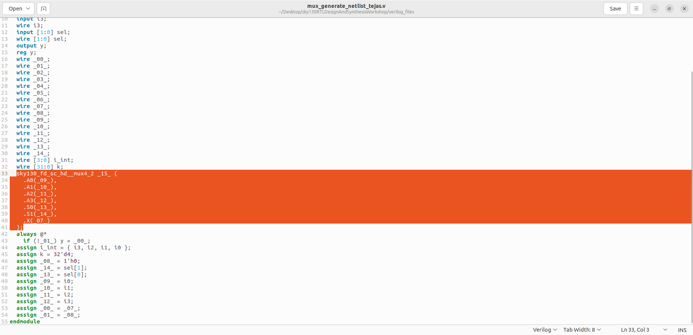
  <p><b>Synthesized Netlist of module mux_generate</b></p>
</div>

<br>

<div align="center">
  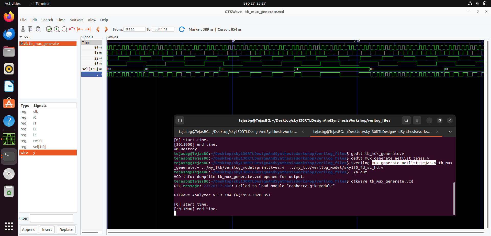
  <p><b>Gate Level Simulation of the Synthesized Netlist of module mux_generate</b></p>
</div>

This above output matches with the RTL simulated output of module `mux_generate` which intern matches with a `4:1 Mux`.
<br>

---

### (b) `generate for` Loop  
- **Usage:** Written **outside always blocks**.  
- Purpose: To **instantiate hardware multiple times**.  
- Commonly used for creating arrays of logic gates, adders, multiplexers, decoders, etc.  
- Helps avoid writing repetitive module instantiations.  

**Generic Syntax:**  

```verilog
genvar i;  
generate  
 for (i = 0; i < N; i = i + 1) begin : label  
  module_name instance_name ( .port1(sig1), .port2(sig2) );  
 end  
endgenerate
```

---

### Why We Use Loops in Hardware Design  
- To simplify the description of repetitive structures.  
- **For loop (inside always):** Handles indexing or iterative calculations.  
- **Generate for loop:** Used to build scalable hardware such as:  
  - Multiplexers (e.g., 8:1 mux built using multiple 2:1 muxes).  
  - Decoders and encoders.  
  - Arrays of adders, registers, or flip-flops.  

Example:  
- To design an 8:1 multiplexer using smaller 2:1 multiplexers, we can use a generate loop to instantiate 7 mux modules, automatically wiring them in a tree structure.  

---  

- **Example Demux using case & Loops**
  
<div align="center">
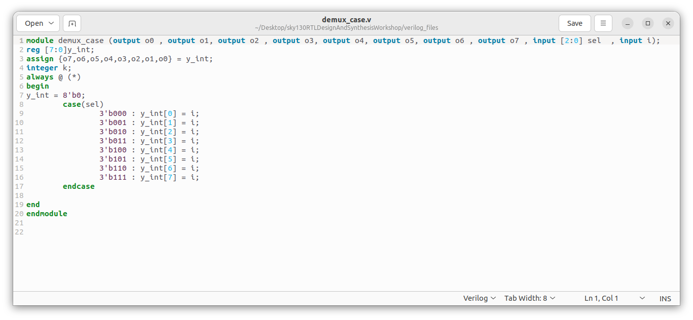 
  <p><b>RTL Code of module demux_case</b></p>
</div>

<br>

<div align="center">
  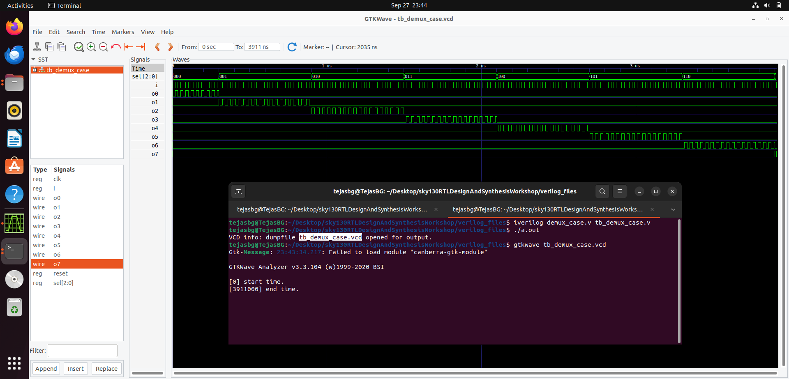
  <p><b>RTL Simulation Output </b></p>
</div>
<br>


<div align="center">
  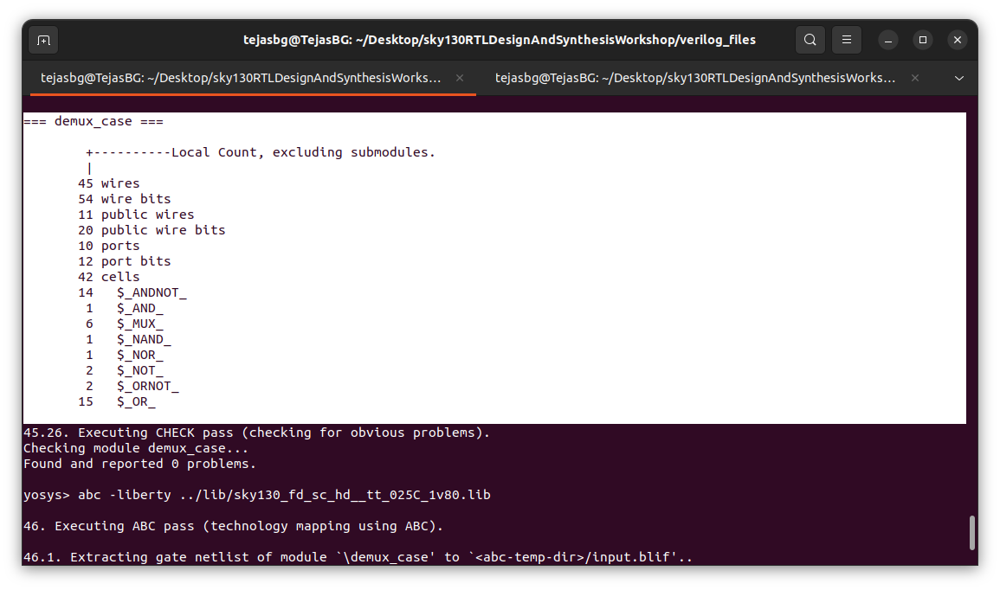
  <p><b>Cells as Infered by Yosys</b></p>
</div>

<br>


<div align="center">
  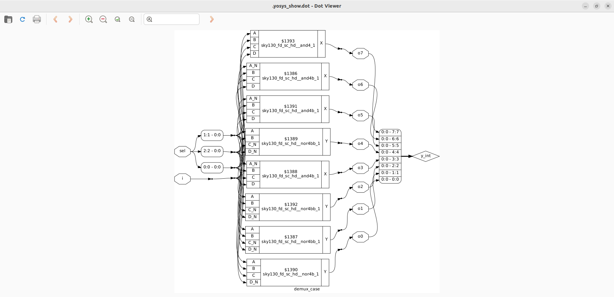
  <p><b>Graphical Representation of Synthesized Netlist of module demux_generate</b></p>
</div>

<br>

<div align="center">
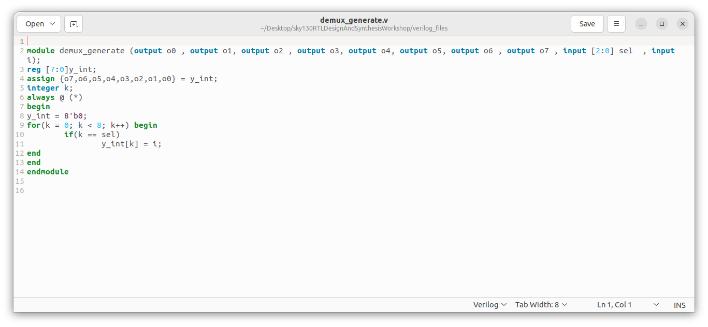 
  <p><b>RTL Code of module demux_generate</b></p>
</div>

<br>

<div align="center">
  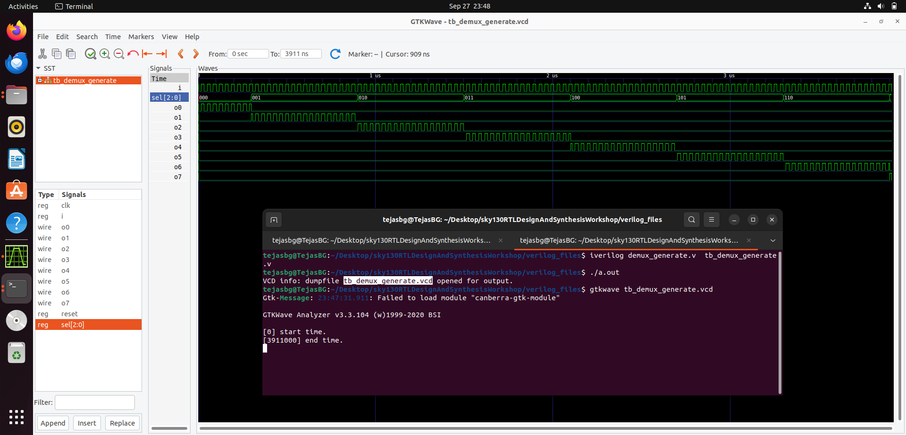
  <p><b>RTL Simulation Output </b></p>
</div>
<br>


<div align="center">
  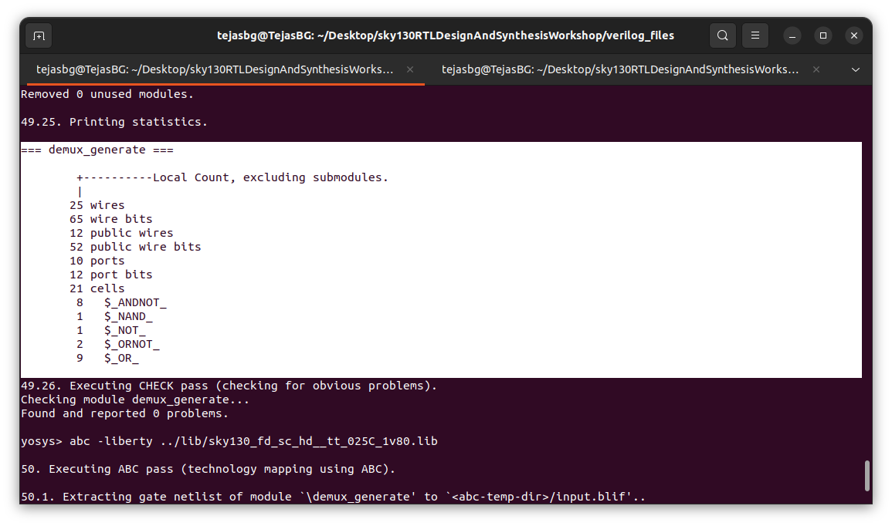
  <p><b>Cells as Infered by Yosys</b></p>
</div>

<br>


<div align="center">
  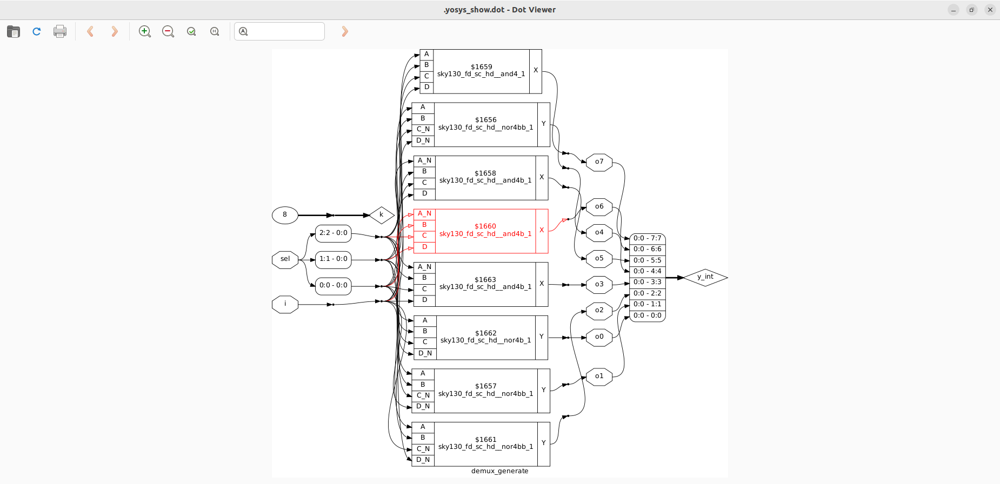
  <p><b>Graphical Representation of Synthesized Netlist of module demux_generate</b></p>
</div>

<br>

As We can observe both RTL simulated outputs & Synthesized netlist of `demux_case` & `demux_generate` the same.

---
- **Example Ripple Carry Adder using Full Adders**
  
<div align="center">
 
  <p><b>RTL Code of module demux_case</b></p>
</div>

<br>

<div align="center">
  
  <p><b>RTL Simulation Output </b></p>
</div>
<br>


<div align="center">
  
  <p><b>Cells as Infered by Yosys</b></p>
</div>

<br>


<div align="center">
  
  <p><b>Graphical Representation of Synthesized Netlist of module demux_generate</b></p>
</div>

<br>

<div align="center">
 
  <p><b>RTL Code of module demux_generate</b></p>
</div>

<br>

<div align="center">
  
  <p><b>RTL Simulation Output </b></p>
</div>
<br>


<div align="center">
  
  <p><b>Cells as Infered by Yosys</b></p>
</div>

<br>


<div align="center">
  
  <p><b>Graphical Representation of Synthesized Netlist of module demux_generate</b></p>
</div>

<br>

As We can observe both RTL simulated outputs & Synthesized netlist of `demux_case` & `demux_generate` the same.


