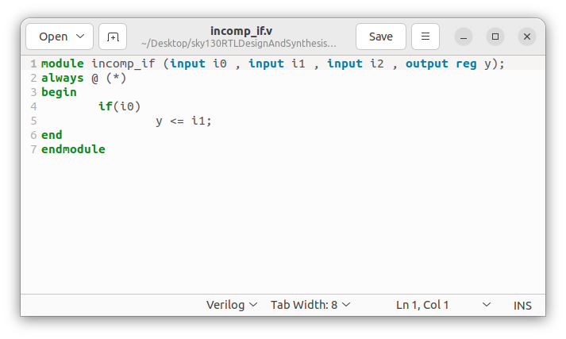
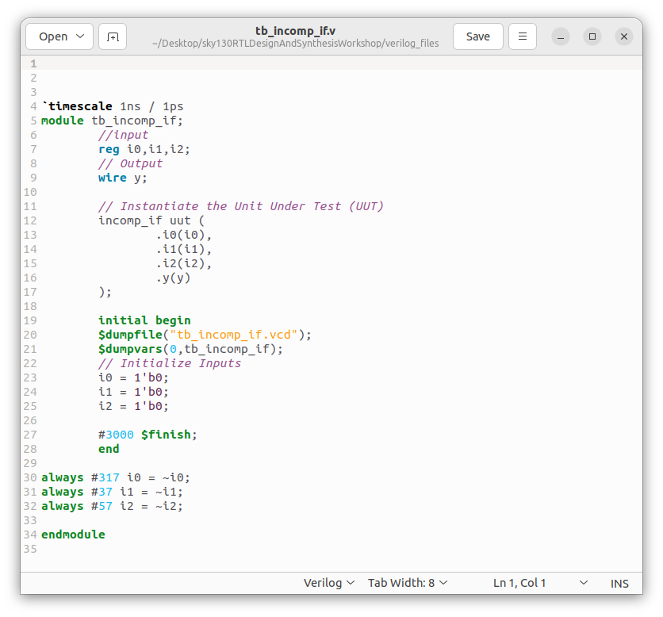
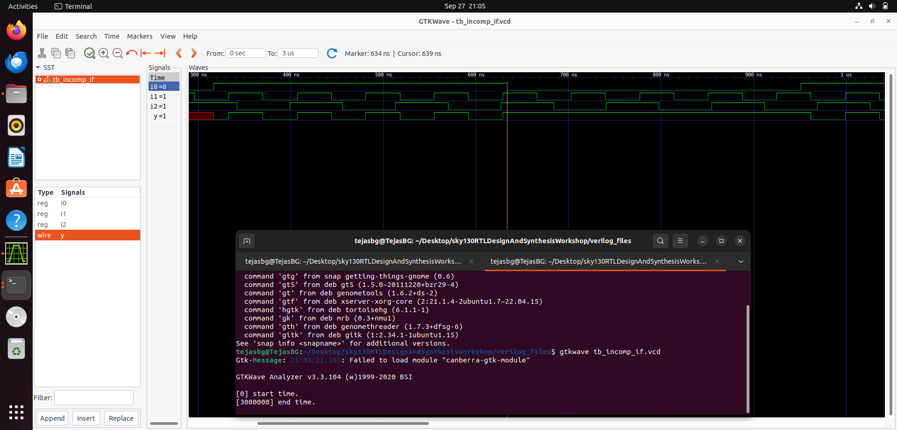
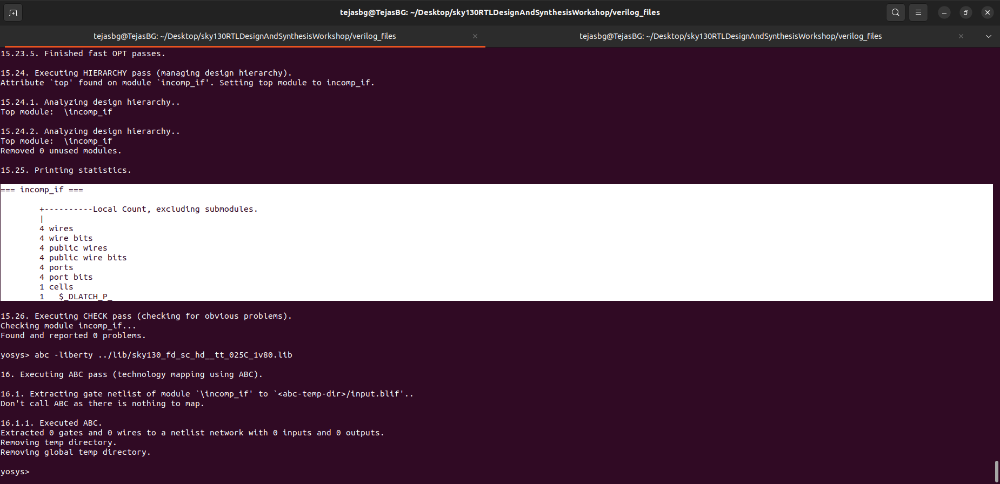
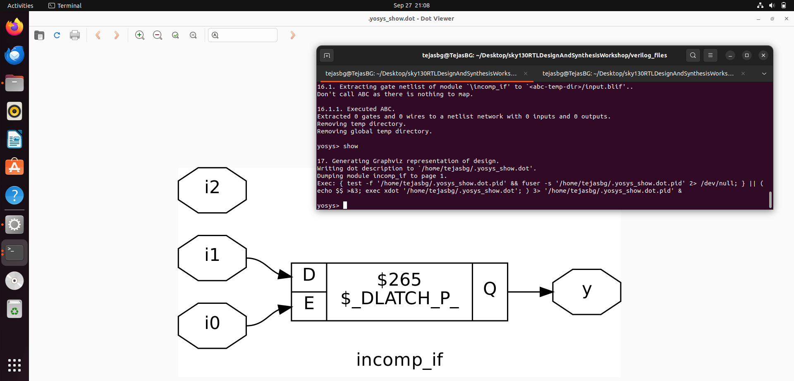
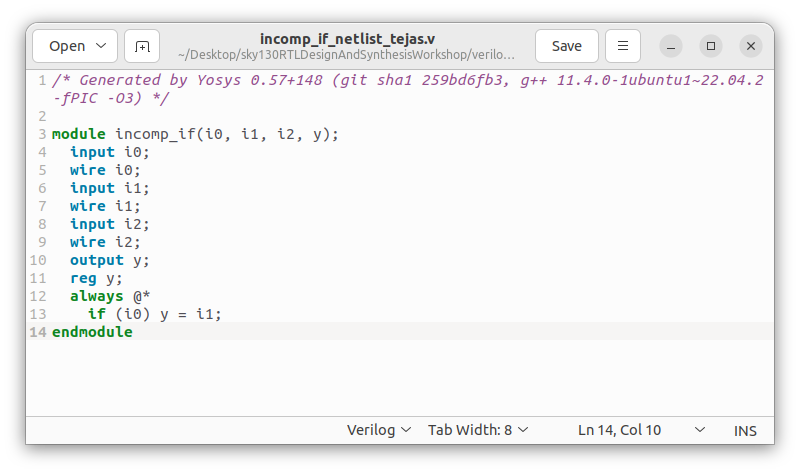

# Day-05: Good & Bad Coding Practices when dealing with if-else, Case and Loops  

---

## 1. If–Else Statements  

**Introduction:**  
- The `if–elseif–else` chain is **priority-based**.  
- First condition is checked, if true it executes, otherwise moves down the chain.  
- Useful for priority encoders and similar logic.  

**Generic Syntax (text only):**  
if (condition1)  
  statement1;  
else if (condition2)  
  statement2;  
else  
  statement3;  

**Cautions / Dangers:**  
- If you forget to specify all branches, the synthesizer will infer a **latch**.  
- Latches are dangerous in synchronous designs because they cause timing and metastability issues.  

**Example (incomplete if causing latch):**  

| RTL Code of module incomp_if |  Test Bench of module incomp_if |
|--------------------------------------------|------------------------------------------|
|  |  | 
<br>

<div align="center">
  
  <p><b>RTL Simulation Output</b></p>
</div>

<br>

<div align="center">
  
  <p><b>As Expected only 1 Dlatch is Infered by Yosys</b></p>
</div>

<br>


<div align="center">
  
  <p><b>Graphical Representation of Synthesized Netlist of module incomp_if</b></p>
</div>

<br>


<div align="center">
  
  <p><b>Synthesized Netlist of module incomp_if</b></p>
</div>

<br>


**Note:**  
- `if` statements and `case` statements are written **inside an always block**.  
- The variables assigned inside must be declared as **reg**.  

---

## 2. Case Statements  

**Introduction:**  
- A case statement compares an expression against multiple possible values.  
- Variants:  
  - `case` → standard case matching.  
  - `casex` → treats `x` and `z` as don’t-care during comparison.  
  - `casez` → treats `z` as don’t-care (but not `x`).  

**Generic Syntax:**  
```verilog
case (expression)  
 value1 : statement1;  
 value2 : statement2;  
 default : statementN;  
endcase
```

**Important:**  
- Case must also be written inside an always block.  
- The target variables must be declared as **reg**.  

---

### Hazards / Cautions with Case  

1. **Incomplete Case:**  
   - If all possible conditions are not covered (and no `default` is present), it infers a **latch**.  
   - Example: I have simulation and synthesis images for this (will attach).  

2. **Partial Assignment in Case:**  
   - If in one case branch not all variables are assigned, then the unassigned variable holds its previous value → latch inferred.  
   - Example (in text):  
     case (sel)  
  2'b00 : a = x; b = y;  
  2'b01 : a = z; // b not assigned → latch inferred for b  
  default : a = 0; b = 0;  
     endcase  

3. **Overlapping Case:**  
   - If two or more case items overlap (like using wildcards `2'b1?`), then multiple matches may occur.  
   - This can cause unintended priority or mismatches between simulation and synthesis.  
   - Example images will be attached.  

---
